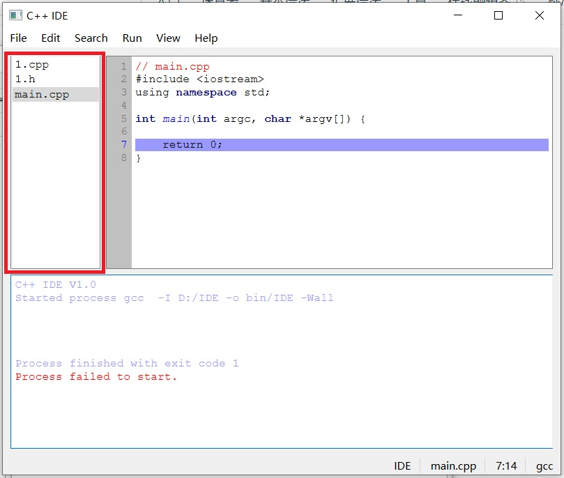
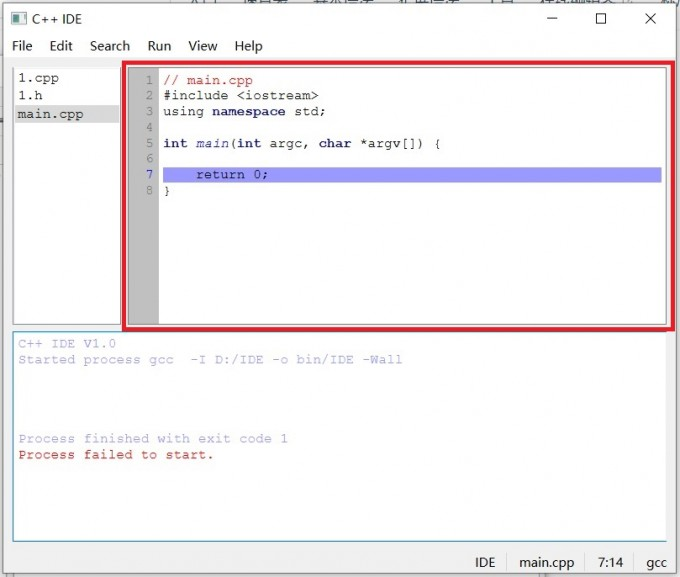
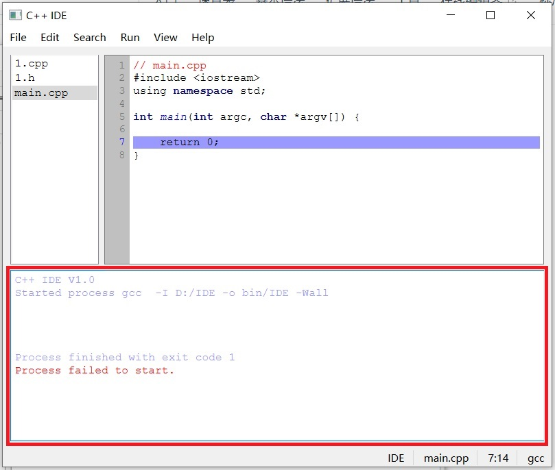
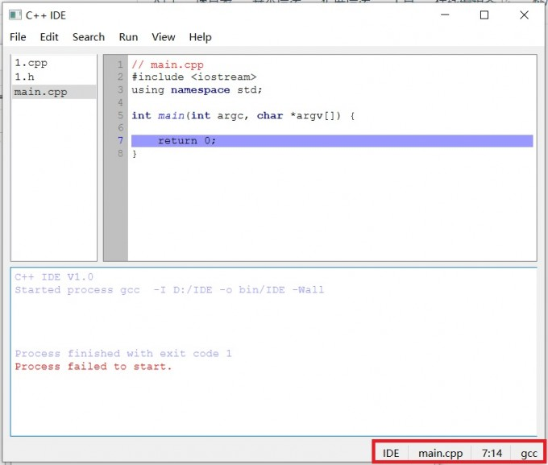
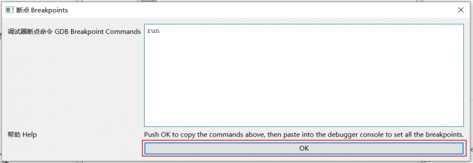

# QTcppIDE
A simple C/C++ IDE made with the Qt C++ framework.
This is part of a ECE Internship class programming project by Luigi Pizzolito, 杨钊毅, 林振民, 张瑞清 and 阮子航 at Beijing Institute of Technology by professors 聂青 and 吴浩.
Basic editing, compiling and debugging features implemented for both Linux and Windows.

---

这个用Qt制作的简单的C/C++集成开发环境是北京理工大学的Luigi Pizzolito、杨钊毅、林振民、张瑞清和阮子航的ECE实习班编程项目的一部分，由聂青和吴浩教授制作。
为Linux和Windows实现了基本的编辑、编译和调试功能。

*向下滚动或使用目录跳到中文版本*

---

[Demo Video]

---

<!-- TOC -->

- [QTcppIDE](#qtcppide)
- [English](#english)
    - [Features](#features)
        - [Complete](#complete)
        - [Dropped Features](#dropped-features)
    - [Install](#install)
    - [How to use](#how-to-use)
        - [Basic Layout](#basic-layout)
            - [File Management Side Bar](#file-management-side-bar)
            - [Code Editor](#code-editor)
            - [Debugging Console](#debugging-console)
            - [Status bar](#status-bar)
        - [Menu bar](#menu-bar)
            - [File](#file)
            - [Edit](#edit)
            - [Search](#search)
            - [Run](#run)
            - [View](#view)
            - [Help](#help)
- [中文](#%E4%B8%AD%E6%96%87)
    - [一、软件主要功能](#%E4%B8%80%E8%BD%AF%E4%BB%B6%E4%B8%BB%E8%A6%81%E5%8A%9F%E8%83%BD)
    - [二、使用方法](#%E4%BA%8C%E4%BD%BF%E7%94%A8%E6%96%B9%E6%B3%95)
        - [在Windows上无法运行的解决办法](#%E5%9C%A8windows%E4%B8%8A%E6%97%A0%E6%B3%95%E8%BF%90%E8%A1%8C%E7%9A%84%E8%A7%A3%E5%86%B3%E5%8A%9E%E6%B3%95)
    - [三、菜单栏](#%E4%B8%89%E8%8F%9C%E5%8D%95%E6%A0%8F)
        - ["File"](#file)
            - ["New File"](#new-file)
            - ["New Project"](#new-project)
            - ["Open"](#open)
            - ["Save"](#save)
            - ["Delete File"](#delete-file)
            - ["Exit"](#exit)
        - ["Edit"](#edit)
            - ["Undo"](#undo)
            - ["Redo"](#redo)
            - ["Cut"](#cut)
            - ["Copy"](#copy)
            - ["Paste"](#paste)
            - ["Select All"](#select-all)
        - ["Search"](#search)
            - ["Search"](#search)
            - ["Replace"](#replace)
            - ["Switch Header/Source"](#switch-headersource)
        - ["Run"](#run)
            - ["Compile"](#compile)
            - ["Run"](#run)
            - ["Compile and Run"](#compile-and-run)
            - ["Generate Breakpoints"](#generate-breakpoints)
            - ["CleanBuild and Break Points"](#cleanbuild-and-break-points)
            - ["Stop/kill"](#stopkill)
            - ["Clear Console"](#clear-console)
            - ["Settings"](#settings)
        - ["View"](#view)
            - ["Zoom In"](#zoom-in)
            - ["Zoom Out"](#zoom-out)
            - ["Goto Line"](#goto-line)
        - ["Help"](#help)
            - ["Documentation"](#documentation)
            - ["About"](#about)
    - [四、文件管理部分](#%E5%9B%9B%E6%96%87%E4%BB%B6%E7%AE%A1%E7%90%86%E9%83%A8%E5%88%86)
    - [五、代码显示部分](#%E4%BA%94%E4%BB%A3%E7%A0%81%E6%98%BE%E7%A4%BA%E9%83%A8%E5%88%86)
    - [六、调试控制台](#%E5%85%AD%E8%B0%83%E8%AF%95%E6%8E%A7%E5%88%B6%E5%8F%B0)
    - [七、状态栏](#%E4%B8%83%E7%8A%B6%E6%80%81%E6%A0%8F)

<!-- /TOC -->

---

# English 
---

## Features

### Complete
- Text editor with line numbers and syntax highlighting.
- In-Editor help/documentation.
- File Open.
- Open folder with multiple files.
- Support to use multiple compilers/linkers.
    - C and C++ support (selectable).
    - Launch in external console.
- Restore settings on startup and restore defaults.
- Project starter templates.
- Toolbar
    - Undo and Redo. (edit menu)
- Search and Replace.
- Right click menu.
- Clean project folder
- View menu for zoom in and out.
- Error handling when launching procceses.
- File save.
- Line number goto.
- Switch between .cpp and .h file.
- Bottom status bar.
    - Line number and column display.
- Debugger support.
    - Breakpoint setting.
    - Support to use multiple debuggers.
- About markdown file.
- Documentation markdown file.
- Cross-platform: Linux and Windows.

### Dropped Features
- Automatically install compiler/debugger for Windows.
- *Code Folding.
- Change file open to QTreeView to support subfolders.
- Save as.
- Save before quit.

## Install

On Linux, ensure you have the `g++`, `gcc`, `gdb` or `lldb` packages installed from your package manager.

On Windows, before using the IDE you must install `w64devkit` to provide the compiler and debugger.
1. Install [w64devkit](https://github.com/skeeto/w64devkit), recommended to copy w64devkit folder directly to `C:\`.
2. Add the w64devkit install directory to your path: Open `cmd` as administrator and then run `set PATH=C:\path\to\w64devkit\bin;%PATH%` (change this path to the path where you installed the w64devkit folder first! For example `set PATH=C:\w64devkit\bin;%PATH%`).

## How to use
1. Open a folder containing C/C++ files or create a new project.
2. Choose which file to edit with the sidebar, edit files as needed.
3. Configure compiler for your OS, or just pick from preset.
4. Compile.
5. If using a debugging preset, you may click on the line numbers to create breakpoints and generate the breakpoint commands from the run menu.
6. Run, paste in the breakpoint commands if using a debugging preset.

### Basic Layout
####  File Management Side Bar

The upper left side of the interface will show all the files you have opened, so you can switch between them at any time.

#### Code Editor

The upper right side of the interface is the part where you write code. To make it easier for you to write code, the software will mark keywords as bold dark blue, class names as bold dark magenta, quotation marks and their contents as dark green, function names as blue and italic, comments and multi-line comments as red.

#### Debugging Console

The lower part of the interface is the debug console, where the software will print the compilation log and errors for viewing.

#### Status bar

### Menu bar

#### File
In this sub-menu, you will find options for creating new files from templates. Including class templates for cpp+h combo files, and C++ and C file starter templates.
There is a status bar at the bottom right corner of the software, from left to right are the folder name, file name, number of lines, number of columns, and the compiler used.
You will also find functions to create a new project (folder), save, delete files, and exit the IDE.

#### Edit
In the edit sub-menu you will find basic features such as undo, redo, cut, copy, paste and select all.

#### Search
Here you will find functions to open the search and search and replace dialogs.
As well as that, there is a handy function to quickly switch between .cpp and .h files of the same name by pressing F4; this is really useful when programming C++ classes.

#### Run
This submenu contains most of the features of the IDE:
- Compile, Run, Compile and Run, Clean your project from source code to a binary executable.
- Generate breakpoints: creates commands that can be pasted into GDB/LLDB debugger to set the breakpoints which you have selected in the editor.
- Stop/kill proccess and clear console manage the console at the bottom of the IDE.

It also contains the settigns menu, where you can specify all the compiler and execution settings and command-line flags. In a system that takes advantege of replaceable expressions which are explained in the settings menu itself. It also contains quick presets, which may be used out of the box without any configuration, provided you already have gcc/g++ and gdb/lldb installed.

#### View
This sub-menu contains basic functions such as zoom in and zoom out (increaase or decrease font size). As well as a utility function to go to a specific line of a file.

#### Help
From this menu you can access this documentation from the IDE's editor as well as view more basic information about this project.

**For more info on how to use this IDE, please refer to the demonstration video linked above**

---

# 中文
---

## 一、软件主要功能 

- 文本编辑器带有行号并且能实现语法高亮
- 包含帮助文档
- 能够简单地打开包含所要编辑文件的文件夹并且能同时打开多个文件
- 支持使用不同的编译器/链接器
  - 支持C语言和C++语言
- 启动时会保留上一次关闭时的设置和所打开的文件
- 新建文件时会自动填充相应模板
- 可以实现撤销和重做
- 可以实现搜索和替换
- 鼠标右键可以唤出相应菜单
- 可以一键清除经过编译后的文件以及已经设置的断点
- 可以放大和缩小文字
- 当代码编译或运行出错时会显示
- 可以实现快速跳转到某一行
- 可以实现在同名.cpp和.h文件间的快速跳转
- 拥有底部状态栏
  - 可以显示行号和列号
  - 可以显示文件夹名和文件名
- 支持进行调试
  - 支持设置断点
  - 支持使用不同的调试器

## 二、使用方法

1. 打开一个包含C或C++文件的文件夹或创建一个新的项目
2. 在上部左侧文件管理部分选择您将要编辑的文件
3. 为您的软件配置编译器或者直接从预设的编译中选择
4. 编译
5. 如果您希望进行调试，您可以单击行号以创建断点并在Run菜单下执行Generate Breakpoints选项，在弹出的对话框中选择OK选项，同时应该将所设置的编译器改为包含GDB的选项
6. 单击Run选项，如果选择的编译器为包含GDB的选项，则会弹出[GDB程序调试器](https://zhuanlan.zhihu.com/p/297925056);否则，将会直接运行运行程序

### 在Windows上无法运行的解决办法

1. 下载[w64devkit](https://github.com/skeeto/w64devkit)，建议将其安装在 `C:\`
2. 将w64devkit添加到目标路径：以管理员身份运行`cmd`，输入`set PATH=c:\path\to\w64devkit\bin;%PATH%`

## 三、菜单栏

每一个选项后均有其对应的快捷方式

### 1."File"

与文件相关的菜单栏

#### "New File"

新建一个文件，选择不同的文件类型会创建不同后缀的文件，如果选择“cpp/h”选项软件会同时创建.cpp和.h后缀文件

#### "New Project"

由您选择文件夹，软件会自动在文件夹中生成一个“main.cpp”文件并且会将其它的文件一并保存在该文件夹中，生成一个项目

#### "Open"

打开您所选择的文件夹中的文件

#### "Save"

保存您所编辑的文件

#### "Delete File"

关闭您所选的文件

#### "Exit"

退出软件

---

### 2."Edit"

文本编辑菜单栏

#### "Undo"

撤销您的上一步操作

#### "Redo"

重新进行您之前撤销的操作

#### "Cut"

复制并删除您所选的内容

#### "Copy"

复制您所选的内容

#### "Paste"

粘贴您之前复制的内容

#### "Select All"

选择当前文件下的所有内容

### 3."Search"

用来查找和替换的菜单栏

#### "Search"

查找相应的文字并选中

#### "Replace"

查找并替换相应的文字，您可以使用这个功能来批量替换函数名或变量名

#### "Switch Header/Source"

自动跳转到同名的头文件或源文件，方便您同时对头文件和源文件进行修改

---

### 3."Run"
编译和调试工具栏

#### "Compile"

根据您所选编译器对代码进行编译

#### "Run"

在经过编译后执行代码

#### "Compile and Run"

编译并执行代码

#### "Generate Breakpoints"

在您选择断点后再选择此选项，可以自动生成您需要在GDB中输入的代码，在弹出的对话框中选择OK选项即可复制生成的代码

#### "Clean(Build and Break Points)"

清除所有已编译的文件和所有已选择的断点

#### "Stop/kill"

结束正在运行的应用

#### "Clear Console"

清空调试控制台

#### "Settings"

您可以在这里设置编译器及其输入文件类型和输出文件的位置

---

### 4."View"

视图工具栏

#### "Zoom In"

增大字体

#### "Zoom Out"

减小字体

#### "Goto Line"

跳转到当前文件相应行

### 5."Help"

帮助菜单

#### "Documentation"

打开此文档

#### "About"

查看关于此软件的信息

## 四、文件管理部分

界面上部左侧会显示您所打开的所有文件，方便您随时切换

## 五、代码显示部分

界面上部右侧是您进行代码编写的部分，为了让您更方便地进行代码编写，软件会将关键字标为粗体深蓝色，类名称标为粗体深洋红色，引号及其中内容标为深绿色，函数名称标为蓝色和斜体，注释和多行注释标为红色

## 六、调试控制台

界面下部是调试控制台，软件会将编译日志以及出现的错误打印在这里以供查看

## 七、状态栏

软件右下角有状态栏，从左到右分别为文件夹名、文件名、行数、列数、所使用的编译器